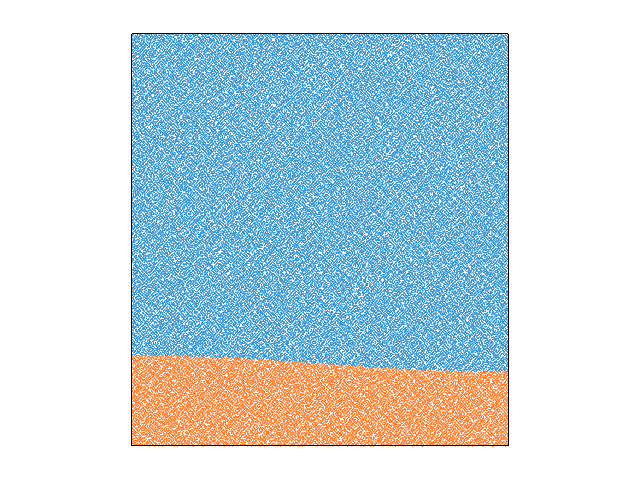

<table><tr><td></td><td></td></tr></table>

Abstract
-----
Numerical models have become an indispensable tool for understanding and predicting the flow of ice
sheets and glaciers. Here we present the full-Stokes software
package Underworld to the glaciological community. The
code is already well established in simulating complex geodynamic systems. Advantages for glaciology are that it provides a full-Stokes solution for elastic–viscous–plastic materials and includes mechanical anisotropy. Underworld uses a
material point method to track the full history information of
Lagrangian material points, of stratigraphic layers and of free
surfaces. We show that Underworld successfully reproduces
the results of other full-Stokes models for the benchmark experiments of the Ice Sheet Model Intercomparison Project for
Higher-Order Models (ISMIP-HOM). Furthermore, we test
finite-element meshes with different geometries and highlight the need to be able to adapt the finite-element grid to
discontinuous interfaces between materials with strongly different properties, such as the ice–bedrock boundary

More details on this project can be seen [here](https://doi.org/10.5194/gmd-15-1-2022):
Sachau, T., Yang, H., Lang, J., Bons, P.D. and Moresi, L., 2022. ISMIP-HOM benchmark experiments using Underworld. Geoscientific Model Development. 

This study uses Underworld to reproduce the benchmark models provided by [ISMIP–HOM](https://doi.org/10.5194/tc-2-95-2008)

Pattyn, F., Perichon, L., Aschwanden, A., Breuer, B., De Smedt, B., Gagliardini, O., Gudmundsson, G.H., Hindmarsh, R.C., Hubbard, A., Johnson, J.V. and Kleiner, T., 2008. Benchmark experiments for higher-order and full-Stokes ice sheet models (ISMIP–HOM). The Cryosphere, 2(2), pp.95-108., 

Files Description
-----
**_Overview of purpose of the model files/directories included in this repo._**

File | Purpose
--- | ---
`Exp_A_3D.py` | 3D model for the Experiment A. 
`Exp_B_2D.py` | 2D model for the Experiment B. 
`Exp_B_3D.py` | 3D model for the Experiment B.
`Exp_C_3D.py` | 3D model for the Experiment C.
`Exp_D_2D.py` | 2D model for the Experiment D.
`Exp_E_mixed-slip-version.py` | 2D model for the Experiment E with mixed slip.
`Exp_E_mixed-no-slip-version.py` | 2D model for the Experiment E without slip.
`Exp_F_3D.py` | 3D model for the Experiment F.

Tests
-----
**_Please specify how your repository is tested for correctness._**
**_Tests are not required for `laboratory` tagged repositories, although still encouraged._**
**_All other repositories must include a test._**

The attained peak VRMs time is tested against an expected value. If it is outside a given tolerance, an exception is raised.

Parallel Safe
-------------
**_Please specify if your model will operate in parallel, and any caveats._**

Yes, test result should be obtained in both serial and parallel operation.

Check-list
----------
- [ ] (Required) Have you replaced the above sections with your own content? 
- [ ] (Required) Have you updated the Dockerfile to point to your required UW/UWG version? 
- [ ] (Required) Have you included a working Binder badge/link so people can easily run your model?
                 You probably only need to replace `template-project` with your repo name. 
- [ ] (Optional) Have you included an appropriate image for your model? 
