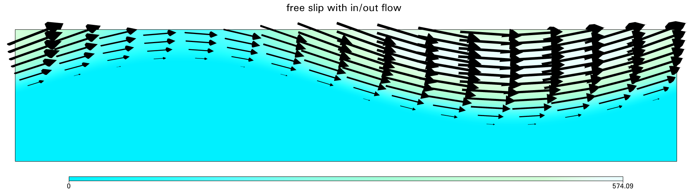

<table><tr><td></td><td></td></tr></table>

Abstract
-----
Numerical models have become an indispensable tool for understanding and predicting the flow of ice
sheets and glaciers. Here we present the full-Stokes software
package Underworld to the glaciological community. The
code is already well established in simulating complex geodynamic systems. Advantages for glaciology are that it provides a full-Stokes solution for elastic–viscous–plastic materials and includes mechanical anisotropy. Underworld uses a
material point method to track the full history information of
Lagrangian material points, of stratigraphic layers and of free
surfaces. We show that Underworld successfully reproduces
the results of other full-Stokes models for the benchmark experiments of the Ice Sheet Model Intercomparison Project for
Higher-Order Models (ISMIP-HOM). Furthermore, we test
finite-element meshes with different geometries and highlight the need to be able to adapt the finite-element grid to
discontinuous interfaces between materials with strongly different properties, such as the ice–bedrock boundary

More details on this project can be seen [here](https://doi.org/10.5194/gmd-15-1-2022):
Sachau, T., Yang, H., Lang, J., Bons, P.D. and Moresi, L., 2022. ISMIP-HOM benchmark experiments using Underworld. Geoscientific Model Development. 

Files Description
-----
**_Overview of purpose of the model files/directories included in this repo._**

File | Purpose
--- | ---
`Exp_A_3D.py` | 3D model for the Experiment A in Sachau_et_al_2022. 
`Exp_B_2D.py` | 2D model for the Experiment B. 
`Exp_B_2D.ipynb` | notebook of 2D model for the Experiment B.
`Exp_B_3D.py` | 3D model for the Experiment B.
`Exp_C_3D.py` | 3D model for the Experiment C.
`Exp_D_2D.py` | 2D model for the Experiment D.
`Exp_E_mixed-slip-version.py` | 2D model for the Experiment E with mixed slip.
`Exp_E_mixed-no-slip-version.py` | 2D model for the Experiment E without slip.
`Exp_F_3D.py` | 3D model for the Experiment F.
'velocity_10000.0.png' | image of velocity profile of Exp_B_2D.
'mesh_deform_default_swarm.png' | image of deformed mesh.

Tests
-----

This study uses Underworld to reproduce the benchmark models provided by [ISMIP–HOM](https://doi.org/10.5194/tc-2-95-2008)

Pattyn, F., Perichon, L., Aschwanden, A., Breuer, B., De Smedt, B., Gagliardini, O., Gudmundsson, G.H., Hindmarsh, R.C., Hubbard, A., Johnson, J.V. and Kleiner, T., 2008. Benchmark experiments for higher-order and full-Stokes ice sheet models (ISMIP–HOM). The Cryosphere, 2(2), pp.95-108., 

Parallel Safe
-------------
3D model results can be obtained in parallel operation.

 
